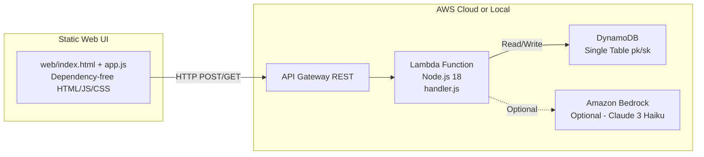
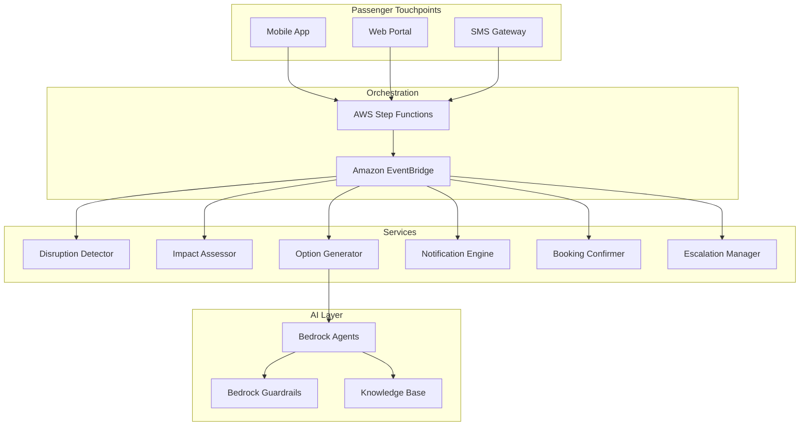

# Solution Architecture — GenAI Disruption Management

## 1. Overview

This document describes the architecture of the GenAI Airline Disruption Management system, covering both the current POC implementation and the target PRD architecture. The POC demonstrates the end-to-end disruption → assessment → rebooking → notification → escalation workflow using AWS serverless services, while the target architecture adds production-grade orchestration, AI agents, and real integrations.

---

## 2. Current POC Architecture

### 2.1 Architecture Diagram



> Full Mermaid source: [diagrams/poc-architecture.mmd](diagrams/poc-architecture.mmd)

### 2.2 Components

| Component | Technology | Role |
|---|---|---|
| **Web UI** | Static HTML/JS/CSS | Simulated airline mobile app — notification center, chat, option cards, booking, escalation |
| **API Gateway** | AWS API Gateway (REST) | HTTP routing with CORS |
| **Lambda** | Node.js 18, single function | All business logic: disruption creation, passenger assessment, option generation, chat, booking, escalation |
| **DynamoDB** | Single-table design (pk/sk) | Stores disruptions, sessions, manifests, options, bookings, escalations, notifications |
| **Bedrock** | Claude 3 Haiku (optional) | Natural-language chat assistant; deterministic fallback when disabled |
| **Local server** | `server-local.js` (Node http) | Runs Lambda handler locally without Docker/SAM |

### 2.3 API Endpoints

| Method | Path | Description |
|---|---|---|
| GET | `/health` | Health check |
| POST | `/disruption` | Create disruption + assess passengers + generate options + prepare notification |
| GET | `/disruption` | List all disruptions |
| POST | `/chat` | Chat with AI assistant |
| POST | `/select-option` | Select a rebooking option |
| POST | `/confirm` | Confirm selection → mock PNR |
| POST | `/escalate` | Escalate → agent handoff packet |
| GET | `/notification` | Retrieve notification for a session |

### 2.4 Data Flow

1. **Disruption Detection**: `POST /disruption` creates disruption record, generates synthetic manifest (200 passengers), assesses tier breakdown & connection risks.
2. **Passenger Impact Assessment**: Manifest summary stored with tier breakdown (Platinum/Gold/Silver/General), connection-at-risk count, proactive-eligible count.
3. **Option Generation**: Rule-based generator creates 4–6 ranked options per passenger, with premium perks for Platinum/Gold. Tight connections (<45 min) are filtered.
4. **Proactive Notification**: Notification copy generated with tier-appropriate messaging, channel selection (push/sms/email), stored in DynamoDB.
5. **Chat**: Optional Bedrock-powered conversation; deterministic fallback shows option summary.
6. **Selection + Confirmation**: Selected option stored; confirmation returns mock PNR with itinerary summary.
7. **Escalation**: Full context packet built (passenger summary, disruption summary, options, selections, transcript, AI recommendation, policy notes).

---

## 3. Target PRD Architecture

### 3.1 Architecture Diagram



> Full Mermaid source: [diagrams/target-architecture.mmd](diagrams/target-architecture.mmd)

### 3.2 Key Differences from POC

| Aspect | POC | Target PRD |
|---|---|---|
| Orchestration | Single Lambda, sequential | Step Functions state machine per disruption |
| Event bus | Direct API calls | EventBridge for decoupled event routing |
| AI | Optional Bedrock chat | Bedrock Agents with Guardrails + Knowledge Bases |
| Data feeds | Synthetic | Real ops feed (flight status API), PSS/GDS (Amadeus/Sabre) |
| Notifications | Simulated | APNS/FCM push, Twilio SMS, SES email |
| Auth | None (POC) | Cognito user pools + API key management |
| Observability | METRIC: console.log | CloudWatch Metrics/Alarms, X-Ray tracing, QuickSight dashboards |
| Security | Open API | WAF, KMS encryption, IAM least privilege, CloudTrail audit |
| Scale | 1 concurrent user | 5,000+ passengers per disruption, multi-region |

---

## 4. Data / State Model

### 4.1 DynamoDB Single-Table Design

All entities share one table with composite key (`pk`, `sk`):

| Entity | pk | sk | Key Fields |
|---|---|---|---|
| **Disruption** | `DISRUPTION#{id}` | `META` | type, reason, airport, createdAt |
| **Manifest Summary** | `DISRUPTION#{id}` | `MANIFEST_SUMMARY` | totalPassengers, tierBreakdown, connectionAtRisk, focusPassengers[] |
| **Session** | `SESSION#{id}` | `META` | sessionId, disruptionId, passenger{}, status |
| **Options** | `SESSION#{id}` | `OPTIONS` | options[] (rank, flights, class, costDelta, rationale, premiumPerks) |
| **Notification** | `SESSION#{id}` | `NOTIFICATION` | body, channels, primaryChannel, notificationSentAt |
| **Chat Turn** | `SESSION#{id}` | `TURN#{ts}#{seq}` | role, content, timestamp |
| **Selection** | `SESSION#{id}` | `SELECTION` | optionId, selected{}, selectedAt |
| **Booking** | `SESSION#{id}` | `BOOKING` | pnr, status, itinerarySummary{}, offlineNote |
| **Escalation** | `SESSION#{id}` | `ESCALATION` | passengerSummary, disruptionSummary, optionsPresented, aiRecommendation, policyNotes |

### 4.2 Key Data Objects

#### Disruption
```json
{
  "type": "CANCELLATION | DELAY | DIVERSION",
  "reason": "Severe weather – thunderstorm at FRA",
  "airport": "FRA",
  "createdAt": "2026-02-25T10:00:00Z"
}
```

#### PassengerState
```json
{
  "passengerId": "PAX-0001",
  "firstName": "Alice",
  "lastName": "Anderson",
  "tier": "Platinum",
  "hasApp": true,
  "consentForProactive": true,
  "specialRequirements": null,
  "connectionRisk": { "connectingFlight": "UA4521", "connectionTime": 35, "atRisk": true },
  "origin": "FRA",
  "destination": "JFK",
  "flightNumber": "UA891",
  "seatClass": "Business"
}
```

#### Option
```json
{
  "optionId": "A",
  "rank": 1,
  "flights": ["UA2041 FRA→JFK"],
  "routing": "FRA→JFK (direct)",
  "class": "Business",
  "costDelta": 0,
  "rationale": "Earliest direct flight with confirmed availability",
  "compatibility": 0.95,
  "premiumPerks": ["Lounge access at origin", "Priority boarding"]
}
```

#### EscalationPacket
```json
{
  "passengerSummary": { "name": "Alice Anderson", "tier": "Platinum", "..." : "..." },
  "disruptionSummary": { "type": "CANCELLATION", "reason": "...", "..." : "..." },
  "optionsPresented": [ "..." ],
  "selectionHistory": { "selectedOption": "...", "declined": false },
  "transcript": [ "..." ],
  "aiRecommendation": "PRIORITY: High-value Platinum member...",
  "policyNotes": { "eu261": "...", "gdpr": "...", "consentStatus": "..." },
  "priority": "HIGH",
  "escalatedAt": "2026-02-25T10:15:00Z"
}
```

---

## 5. Security & Compliance Notes (Document-Only for POC)

### 5.1 GDPR Considerations

| Control | POC Status | Production Requirement |
|---|---|---|
| **PII Minimization** | ✅ Synthetic data only, no real PII | Encrypt PII at rest (KMS) and in transit (TLS 1.2+) |
| **Data Retention** | ℹ️ In-memory store (clears on restart) | Configure DynamoDB TTL; S3 lifecycle policies; 90-day retention default |
| **Consent Management** | ✅ `consentForProactive` field on passenger | Full consent service with opt-in/opt-out tracking |
| **Right to Erasure** | ℹ️ Not implemented | Implement DELETE endpoint to purge passenger data |
| **Audit Trail** | ✅ METRIC: logs | CloudTrail + DynamoDB Streams for full audit |
| **Data Processing Agreement** | N/A (synthetic) | Required for any real passenger data processing |

### 5.2 EU261 Compliance

| Requirement | POC Status | Production Requirement |
|---|---|---|
| **Notification within 2 weeks** | ✅ Proactive notification generated immediately | Real-time push + SMS/email within regulatory window |
| **Rebooking or refund offer** | ✅ Options include rebooking | Integrate refund path; document choice offered |
| **Care & assistance** | ✅ Hotel/meal vouchers in premium perks | Automate care voucher issuance based on delay duration |
| **Compensation tracking** | ℹ️ Escalation packet includes EU261 note | Auto-calculate compensation amounts; track claims |

### 5.3 Security Posture

| Layer | POC | Production |
|---|---|---|
| **Network** | Open CORS (*) | WAF rules, VPC endpoints, private subnets |
| **Auth** | None | Cognito + API keys + request signing |
| **Encryption** | None | KMS at rest, TLS in transit, field-level encryption for PII |
| **IAM** | Broad Lambda role | Least privilege per function, service control policies |
| **Logging** | console.log METRIC: | Structured logs → CloudWatch → OpenSearch; CloudTrail for API audit |
