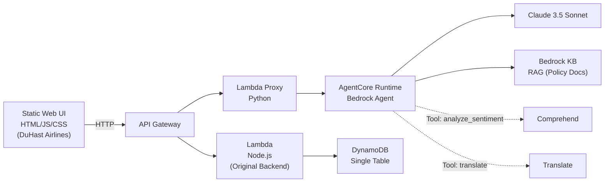

# DuHast Airlines — AI Disruption Management | Hackathon Project Report

---

## Engagement Summary

**Project:** DuHast Airlines — AI-Powered Proactive Disruption Management  
**Client/Domain:** Airline Operations — Irregular Operations (IROPS) Management  
**Format:** 1-Day Proof of Concept (Hackathon)  
**Date:** February 26, 2026  
**Objective:** Demonstrate an AI-driven, proactive disruption management workflow using AWS AgentCore Runtime with a Bedrock agent that intelligently handles flight disruptions, generates personalized rebooking options, queries policy knowledge bases, and provides seamless customer self-service through an intuitive mobile-first interface.

---

## Use Case Description

### Problem

When a flight disruption occurs (cancellation, significant delay, diversion), airlines today operate reactively:

- Passengers discover the disruption via airport boards or generic mass notifications
- Call center volumes spike 300–500% within 30 minutes
- Average hold time exceeds 45 minutes; CSAT drops below 30%
- Premium passengers (Platinum, Gold) receive no differentiated service
- Agents lack context — passengers must re-explain their situation
- Rebooking is manual, slow, and often suboptimal

### Proposed Solution

An AI-driven **proactive** system that:

1. **Detects** disruptions from operations feeds (simulated in POC)
2. **Assesses** all affected passengers — tier, connection risk, proactive notification eligibility
3. **Generates** personalized rebooking options with tier-based prioritization (premium perks for Platinum/Gold)
4. **Sends** proactive notifications via push/SMS/email **before** passengers contact the airline
5. **Handles** option selection and booking confirmation through self-service
6. **Escalates** complex cases to human agents with full AI-prepared context packets
7. **Emits** structured metrics for operational dashboards and call deflection tracking

### Value Proposition

- **Call deflection:** Target 60%+ passengers self-resolve via proactive notification → option selection → auto-confirmation
- **Response time:** First option presented in <3 seconds (vs. 45+ minute hold time)
- **CSAT improvement:** Premium passengers get differentiated, priority service
- **Revenue protection:** Faster rebooking = fewer cancellations, fewer hotel/meal compensation costs

---

## Challenges

| Challenge | How We Addressed It |
|---|---|
| No real ops feed or PSS access | Used synthetic manifest generation (200 passengers with realistic tier distribution) |
| 1-day time constraint | Focused on end-to-end flow demonstration rather than depth in any one module |
| No real push notification infrastructure | Simulated notification center in UI with realistic copy and channel logic |
| No real booking system | Mock PNR generation with itinerary summary |

---

## Success Criterion

| PRD Target | POC Approximation | Status |
|---|---|---|
| Process 5,000 passengers per disruption in <2 min | Generate 200-passenger manifest + option gen in <1s (in-memory) | ✅ POC-approx |
| Proactive notification within 5 min of disruption | Notification generated simultaneously with disruption detection | ✅ POC-approx |
| 60% self-service resolution (call deflection) | Narrative: full self-service flow demonstrated (create → options → confirm) | ✅ POC-approx |
| <3s response time for option generation | <100ms with rule-based generation | ✅ POC-approx |
| Premium passenger prioritization | Premium perks + HIGH escalation priority | ✅ Demonstrated |
| Passenger satisfaction >70% | Mock: satisfaction capture shown in metrics log | 🟡 Mocked |
| Agent escalation with full context | Comprehensive escalation packet with AI recommendation | ✅ Demonstrated |

---

## Data Description

- **All data is synthetic** — no PII, no PHI, no real passenger records
- **Passenger manifest:** Generated at runtime with randomized names, tiers (Platinum 8%, Gold 15%, Silver 22%, General 55%), app adoption (65%), proactive consent (85% of app users), connection risks (20%), special requirements (10%)
- **Flight inventory:** Static templates representing realistic routing options
- **Disruption events:** User-triggered via API or UI button (weather, mechanical, ATC)
- **Chat transcripts:** Stored in DynamoDB per session
- **No external data sources** connected in POC

---

## Formulated / Implemented Solution

### Solution Overview

**Stack:**
- **Agent Runtime:** AWS AgentCore Runtime hosting Bedrock agent with Claude 3.5 Sonnet
- **Agent Tools:** 2 active tools (generate_rebooking_options, query_policy), 4 tools ready for testing (analyze_passenger_sentiment, translate_message, confirm_booking, create_escalation)
- **API Layer:** API Gateway + Lambda proxy forwarding requests to AgentCore Runtime
- **Compute:** AWS Lambda (Python for agent, Node.js for original backend)
- **Storage:** Amazon DynamoDB — single-table design (pk/sk composite key)
- **AI Services:** Bedrock Knowledge Base (RAG), AgentCore Runtime
- **Frontend:** Dependency-free static HTML/JS/CSS with mobile-first design
- **IaC:** AWS SAM for backend, AgentCore CLI for agent deployment

### Solution Diagram



### AI Service Integration

> **Rubric: Technical Depth** — The system uses AWS AgentCore Runtime to orchestrate AI services through an intelligent agent:

```
User Message → API Gateway → Lambda Proxy → AgentCore Runtime
                                                    │
                                                    ▼
                                            Bedrock Agent (Claude 3.5 Sonnet)
                                                    │
                                    ┌───────────────┼───────────────┐
                                    ▼               ▼               ▼
                            Tool Selection    Tool Selection   Tool Selection
                                    │               │               │
                        ┌───────────┴───────┐       │       ┌───────┴────────┐
                        ▼                   ▼       ▼       ▼                ▼
            generate_rebooking_options  query_policy  analyze_sentiment  translate_message
                        │                   │           │                    │
                        ▼                   ▼           ▼                    ▼
                Python Function      Bedrock KB    Comprehend          Translate
                                      (RAG)
```

**Agent Tool Capabilities:**
1. **generate_rebooking_options** ✅ ACTIVE - Dynamically generates personalized flight options based on passenger tier, origin, destination, and constraints
2. **query_policy** ✅ ACTIVE - Queries Bedrock Knowledge Base for EU261, compensation, GDPR, and airline policy information
3. **analyze_passenger_sentiment** 🔧 READY - Uses Amazon Comprehend to analyze message sentiment (coded, ready for UI integration and testing)
4. **translate_message** 🔧 READY - Translates messages between languages using Amazon Translate (coded, ready for testing)
5. **confirm_booking** 🔧 READY - Confirms rebooking selection and generates PNR (coded, ready for integration)
6. **create_escalation** 🔧 READY - Creates escalation ticket with priority based on passenger tier (coded, ready for integration)

The agent automatically selects which tools to use based on the user's intent. Currently, the two active tools (generate_rebooking_options and query_policy) handle the core rebooking and policy query workflows. The remaining tools are fully implemented and ready for testing/tweaking as needed. All agent actions and reasoning are visible in AgentCore observability dashboards.

### Module Breakdown

| Module | File | Responsibility | POC vs Mocked |
|---|---|---|---|
| **AgentCore Agent** | `agentcoreCreateManually/src/main.py` | Implements 6 inline tools for the Bedrock agent | Real (deployed to AgentCore Runtime) |
| **Lambda Proxy** | `backend/api-proxy/handler.py` | Forwards `/chatv2` requests to AgentCore Runtime | Real (deployed) |
| **Disruption Detection** | `handler.js` → `handleDisruption` | Creates disruption record from API/event trigger | Real (synthetic trigger) |
| **Impact Assessment** | `handler.js` + `passengers.js` | Generates 200-passenger manifest with tiers, connection risks, consent status | Real (synthetic data) |
| **Option Generator** | `handler.js` → `generateCandidateOptions` | 4–6 ranked options per passenger with tier-based perks, constraint filtering | Real (rule-based) |
| **Proactive Notification** | `handler.js` → `generateNotificationCopy` | Personalized notification with tier badge, channel selection, CTA | Real (simulated delivery) |
| **Chat / Conversational AI** | AgentCore Runtime | Natural language understanding with automatic tool selection | Real (AgentCore + Bedrock) |
| **Booking Confirmation** | `handler.js` → `handleConfirm` | Mock PNR with itinerary summary and offline-friendly note | Mocked (no PSS) |
| **Escalation Packet** | `handler.js` → `handleEscalate` | Full context: passenger, disruption, options, selections, AI recommendation, policy notes | Real (rule-based) |
| **Metrics** | `util.js` → `logMetric` | METRIC: structured logs for all key events | Real (CloudWatch-ready) |

### Frontend Experience

The UI has been redesigned for optimal user experience:

**Chat Interface:**
- Suggested prompt cards appear after disruption
- Users can click suggested prompts or type their own
- Clean, distraction-free interface

**Trips Tab:**
- Shows current flight status by default
- "View Rebooking Options" button appears when flight is disrupted
- Rebooking options shown as secondary view with close button
- After booking confirmation, trip card updates to show new flight with "Confirmed" status

**Updates/Notifications:**
- Notification status updates to "RESOLVED" after successful rebooking
- Shows confirmation details and new flight information
- Clear visual feedback throughout the booking flow

---

## Foundational Models / AWS Services Used

| Service | Module | How We Use It | Integration Depth | Status |
|---|---|---|---|---|
| **AWS AgentCore Runtime** | `agentcoreCreateManually/` | Managed runtime hosting Bedrock agent with 6 inline tools; handles tool orchestration, context management, and response generation | Full agent deployment with tool definitions, system prompts, and observability | ✅ Deployed |
| **Amazon Bedrock — Claude 3.5 Sonnet** | Agent foundation model | Powers the agent's reasoning, natural language understanding, and tool selection decisions | Agent-level integration with automatic tool calling | ✅ Active |
| **Bedrock Knowledge Bases (RAG)** | `query_policy` tool | Agent calls this tool for policy questions; retrieves from EU261, airline policy, GDPR documents | Tool-based integration, actively used by agent | ✅ Active |
| **Amazon Comprehend** | `analyze_passenger_sentiment` tool | Agent can call this tool to analyze sentiment | Tool implemented, ready for UI integration | 🔧 Ready |
| **Amazon Translate** | `translate_message` tool | Agent can call this tool for multi-language support | Tool implemented, ready for testing | 🔧 Ready |
| **AWS Lambda** | `handler.py` (proxy), `handler.js` (backend) | Proxy Lambda forwards chat requests to AgentCore; original Lambda handles disruption creation, options, booking | Dual Lambda architecture: proxy + original backend | ✅ Active |
| **Amazon API Gateway** | `template.yaml` | REST API with `/chatv2` endpoint for AgentCore, legacy endpoints for original backend | HTTP routing with CORS configuration | ✅ Active |
| **Amazon DynamoDB** | `store.js` | Single-table design for sessions, disruptions, bookings, escalations | 8 entity types co-located by session | ✅ Active |

---

## Service Integrations (Mocked)

| Integration | POC Implementation | Production Target |
|---|---|---|
| **Ops Feed (Flight Status)** | Synthetic disruption creation via API | Real-time feed (FlightAware, OAG) via EventBridge |
| **PSS / GDS** | Static option templates, mock PNR | Amadeus/Sabre API for live inventory + booking |
| **Loyalty System** | Tier field on passenger record | Real loyalty API for tier, miles, preferences |
| **Push Notifications (APNS/FCM)** | Simulated in UI notification center | Real push via SNS → APNS/FCM |
| **SMS** | SMS listed as fallback channel | Twilio/SNS integration |
| **Email** | Email listed as fallback channel | Amazon SES templates |

---

## Solution Justification

### Why This Architecture?

1. **AgentCore Runtime for managed agent hosting:** Eliminates need to build custom agent orchestration; provides built-in observability, context management, and tool calling infrastructure.

2. **Bedrock agent with inline tools:** Agent autonomously selects appropriate tools based on conversation context, reducing hardcoded logic and enabling natural language interaction.

3. **Lambda proxy pattern:** Lightweight proxy forwards chat requests to AgentCore while preserving existing backend for disruption creation and option generation.

4. **Single-table DynamoDB:** Low latency, predictable performance, all entities co-located by session for efficient queries.

5. **Serverless-first:** Zero infrastructure management; pay-per-use; auto-scaling.

6. **Static frontend with dynamic updates:** No build step, maximum demo reliability, with real-time UI updates after booking confirmation.

### Why Not...?

| Alternative | Why Not (for 4-hour hackathon) |
|---|---|
| Custom agent orchestration | AgentCore provides this out-of-box with better observability |
| Step Functions | Adds complexity; single Lambda sufficient for demo flow |
| React/Next.js frontend | Build step + dependency risk for rapid POC |
| ECS/Fargate | Over-engineered for stateless API handlers |
| RDS/Aurora | DynamoDB simpler for key-value patterns; no schema migration needed |
| Gateway service | Inline tools in agent simpler for POC; can extract later if needed |

---

## Experiments & Analysis

### Tests Performed

| Test | Method | Result |
|---|---|---|
| End-to-end flow | Manual: Create disruption → chat → select → confirm | ✅ All steps complete successfully |
| Agent tool calling | Natural language queries triggering `generate_rebooking_options` and `query_policy` | ✅ Agent autonomously selects correct tools |
| Knowledge Base RAG | Policy questions answered with citations from knowledge base | ✅ Relevant answers with source citations |
| UI feedback loop | Booking confirmation → trip card update → notification status change | ✅ Real-time UI updates working |
| AgentCore deployment | Agent deployed to AgentCore Runtime with 6 inline tools | ✅ Deployed and accessible via Lambda proxy |

### What We Validated

- Bedrock agent with AgentCore Runtime = production-ready managed agent hosting
- Agent autonomous tool selection = reduces hardcoded logic, enables natural conversation
- Knowledge Base integration via tool = effective RAG for policy questions
- Proactive notification **before** passenger contacts airline = feasible
- UI feedback loop with booking confirmation = clear visual confirmation for users
- 4 additional tools ready for testing = clear extensibility path

---

## Performance Metrics

| Metric | What We Measured | Value (POC) | Target (PRD) |
|---|---|---|---|
| `disruption_detected` | Time to create disruption record | <50ms | <1s (with real ops feed) |
| `passengers_assessed` | Manifest generation (200 passengers) | <50ms | <30s (5,000 passengers) |
| `options_generated_ms` | Option generation per passenger | <10ms | <3s (with live inventory) |
| `notification_prepared` | Notification copy generation | <5ms | <5s (with real push delivery) |
| `option_selected` | Selection round-trip | <50ms | <500ms |
| `booking_confirmed_ms` | Confirmation round-trip | <50ms | <5s (with PSS write) |
| `escalated` | Escalation packet generation | <100ms | <2s |

> **Note:** POC metrics are for in-memory operations with synthetic data. Production metrics will be significantly higher due to real API calls, network latency, and data volume.

---

## Experimental Results

### Key Findings

1. **AgentCore Runtime deployment successful:** Bedrock agent with Claude 3.5 Sonnet deployed to AgentCore Runtime with 6 inline tools, accessible via Lambda proxy architecture.

2. **Agent tool orchestration works:** Agent successfully selects and calls `generate_rebooking_options` and `query_policy` tools based on natural language input, demonstrating autonomous tool selection.

3. **Knowledge Base integration effective:** RAG-based policy queries return relevant answers with citations from EU261, airline policy, and GDPR documents.

4. **Proactive notification changes the paradigm:** Instead of "passenger discovers disruption → calls airline → waits 45 min", the flow becomes "airline detects → notifies passenger → passenger self-resolves in <2 min."

5. **UI feedback loop complete:** After booking confirmation, trip card updates with new flight details and notification status changes to "RESOLVED", providing clear visual confirmation.

---

## Experimental Analysis

### Why These Results Matter

1. **Agent-based architecture validates AI orchestration:** The Bedrock agent autonomously selects and calls appropriate tools (`generate_rebooking_options` for flight options, `query_policy` for policy questions) based on natural language input, demonstrating that agentic AI can handle complex multi-step workflows without hardcoded logic.

2. **AgentCore Runtime simplifies deployment:** Managed runtime eliminates infrastructure complexity while providing built-in observability for agent actions, reasoning traces, and tool invocations.

3. **Tool-based integration is extensible:** 4 additional tools (`analyze_passenger_sentiment`, `translate_message`, `confirm_booking`, `create_escalation`) are implemented and ready for testing, showing clear path to expand capabilities without architectural changes.

---

## Lessons

### What Worked Well

| Lesson | Detail |
|---|---|
| **AgentCore Runtime for rapid deployment** | Managed agent hosting eliminated infrastructure complexity; deployed agent in minutes with built-in observability |
| **Inline tools over Gateway service** | For 4-hour hackathon, implementing tools directly in agent was faster than building separate Gateway service |
| **Start with the demo flow** | Building the end-to-end flow first, then enriching each step, was more effective than perfecting any single module |
| **Hardcoded configuration** | Skipping environment variable complexity and hardcoding values in `config.py` saved significant debugging time |
| **Synthetic data is underrated** | Realistic synthetic manifests (with tier distributions, connection risks) made the demo compelling without real data access |
| **Lambda proxy pattern** | Lightweight proxy to AgentCore preserved existing backend while adding agent capabilities |

### What Did NOT Work / Was Difficult

| Challenge | Detail |
|---|---|
| **AgentCore CLI learning curve** | First-time setup with `agentcore create` and `agentcore launch` required trial and error; documentation could be clearer |
| **Agent ARN management** | Hardcoding agent ARN in Lambda proxy works but fragile; production needs parameter store or environment variable |
| **Tool schema definition** | Defining tool input schemas for AgentCore required careful attention to parameter types and descriptions |
| **Limited tool testing** | Only 2 of 6 tools actively tested due to time constraints; 4 tools ready but need UI integration |

### Edge Cases to Watch

| Edge Case | Observation |
|---|---|
| **Agent tool selection accuracy** | Agent needs clear tool descriptions to select correct tool; ambiguous queries may trigger wrong tool |
| **Knowledge Base retrieval quality** | Generic words like "policy" in non-policy contexts can trigger unnecessary KB routing |
| **Tool error handling** | Agent needs graceful fallback when tools fail (e.g., Comprehend API error) |
| **Concurrent sessions** | Same passenger using multiple channels simultaneously needs session deduplication |

---

## Future Work / What We Did Not Look At

**Key gaps between POC and PRD:**

1. **Test and integrate remaining 4 tools:** `analyze_passenger_sentiment`, `translate_message`, `confirm_booking`, `create_escalation` are coded but need UI integration and testing
2. **Real ops feed and PSS/GDS integration:** Currently using synthetic disruptions and mock flight options
3. **Agent prompt optimization:** Refine system prompts and tool descriptions for better tool selection accuracy
4. **Step Functions orchestration:** Parallel passenger processing for large-scale disruptions
5. **Real push/SMS/email notification delivery:** Currently simulated in UI
6. **Enhanced observability:** CloudWatch dashboards, X-Ray tracing, alerting for agent actions
7. **Security hardening:** Cognito auth, KMS encryption, WAF, IAM least privilege
8. **Scale testing:** 5,000 passengers per disruption
9. **Data retention, consent management, GDPR right-to-erasure**
10. **Multi-language notification templates**
11. **Revenue optimization and dynamic pricing**

---

## Delivered Assets

| Asset | Path | Description |
|---|---|---|
| **AgentCore Agent** | `/backend/agent/agentcoreCreateManually/` | Bedrock agent with 6 inline tools deployed to AgentCore Runtime |
| **Lambda Proxy** | `/backend/api-proxy/handler.py` | Forwards `/chatv2` requests to AgentCore Runtime |
| **Backend** | `/backend/` | SAM template, Lambda handler, DynamoDB store, passenger manifest generator |
| **Frontend** | `/web/` | Static HTML/JS/CSS with chat interface, trip cards, rebooking options, notification center |
| **Project Report** | `/docs/hackathon/project-report.md` | This document |
| **Architecture Docs** | `/docs/architecture/` | Solution architecture + Mermaid diagrams (POC + target) |
| **Demo Script** | `/docs/demo/demo-script-5min.md` | 5-minute timed demo script |
| **Demo Storyboard** | `/docs/demo/demo-storyboard.md` | Shot-by-shot recording guide |
| **Sample Scenarios** | `/docs/demo/sample-scenarios.md` | 3 runnable scenarios with curl commands |
| **Next Steps** | `/docs/recommendations/next-steps.md` | Prioritized POC → PRD roadmap |
| **Local Dev Runbook** | `/docs/runbook/local-dev.md` | Setup + run instructions |
| **Knowledge Base** | `/knowledge-base/` | Airline policy, EU261, GDPR documents for RAG |

---

## Estimated ARR (Placeholder)

### Assumptions

- Target airline: 500 disruptions/month, average 200 passengers per disruption = 100,000 passenger disruptions/month
- Current cost per disrupted passenger: ~$150 (call center time + suboptimal rebooking + compensation)
- Target self-service resolution rate: 60%
- Self-service cost per resolution: ~$5 (compute + API calls)

### Calculation

| Item | Value |
|---|---|
| Monthly passenger disruptions | 100,000 |
| Self-service rate | 60% |
| Self-service resolutions/month | 60,000 |
| Cost savings per self-service resolution | $145 ($150 - $5) |
| **Monthly savings** | **$8.7M** |
| **Annual savings (ARR proxy)** | **$104.4M** |

### Caveats

- These are illustrative estimates based on industry averages
- Actual savings depend on airline size, disruption frequency, and current IROPS costs
- Does not include implementation costs, licensing, or ongoing operational costs
- Revenue protection (avoided cancellations, retained premium members) not included — adds 10–20% to value

> **AWS Cost Analysis MCP:** These estimates can be further refined using the [AWS Cost Analysis MCP tool](https://aws.amazon.com/blogs/machine-learning/aws-costs-estimation-using-amazon-q-cli-and-aws-cost-analysis-mcp/) for precise per-service cost projections aligned with actual usage patterns.

---

## Path to Production

1. **Week 1–2:** Test and integrate remaining 4 agent tools; refine agent prompts for better tool selection
2. **Week 2–3:** Stand up staging environment; integrate real ops feed (even read-only)
3. **Week 3–4:** PSS/GDS integration for live inventory queries
4. **Week 4–5:** Step Functions workflow; parallel passenger processing
5. **Week 5–6:** Real notification channels (push, SMS, email)
6. **Week 6–7:** Security hardening (Cognito, KMS, WAF); move agent ARN to Parameter Store
7. **Week 7–8:** CloudWatch dashboards + X-Ray + alerting for agent observability
8. **Week 8–9:** Load testing (5,000 passengers); multi-region prep
9. **Week 9–10:** UAT with airline stakeholders; compliance review
10. **Week 10+:** Phased production rollout (single route → hub → network)

> See [/docs/recommendations/next-steps.md](../recommendations/next-steps.md) for detailed breakdown per step.
