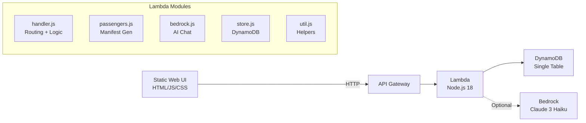

# Hackathon Project Report — GenAI Airline Disruption Management

---

## Engagement Summary

**Project:** GenAI-Powered Airline Disruption Management System  
**Client/Domain:** Airline Operations — Irregular Operations (IROPS) Management  
**Format:** 1-Day Proof of Concept (Hackathon)  
**Date:** February 25, 2026  
**Objective:** Demonstrate an AI-driven, proactive disruption management workflow that detects flight disruptions, assesses passenger impact with tier-based prioritization, generates personalized rebooking options, sends proactive notifications, handles booking confirmations, and produces agent escalation packets — all in under 3 seconds per passenger.

---

## Team

| Role | Name |
|---|---|
| Tech Lead | _[Name]_ |
| Backend Engineer | _[Name]_ |
| Frontend Engineer | _[Name]_ |
| Solutions Architect | _[Name]_ |
| Presenter / PM | _[Name]_ |

---

## Use Case Description

### Problem

When a flight disruption occurs (cancellation, significant delay, diversion), airlines today operate reactively:

- Passengers discover the disruption via airport boards or generic mass notifications
- Call center volumes spike 300–500% within 30 minutes
- Average hold time exceeds 45 minutes; CSAT drops below 30%
- Premium passengers (Platinum, Gold) receive no differentiated service
- Agents lack context — passengers must re-explain their situation
- Rebooking is manual, slow, and often suboptimal

### Proposed Solution

An AI-driven **proactive** system that:

1. **Detects** disruptions from operations feeds (simulated in POC)
2. **Assesses** all affected passengers — tier, connection risk, proactive notification eligibility
3. **Generates** personalized rebooking options with tier-based prioritization (premium perks for Platinum/Gold)
4. **Sends** proactive notifications via push/SMS/email **before** passengers contact the airline
5. **Handles** option selection and booking confirmation through self-service
6. **Escalates** complex cases to human agents with full AI-prepared context packets
7. **Emits** structured metrics for operational dashboards and call deflection tracking

### Value Proposition

- **Call deflection:** Target 60%+ passengers self-resolve via proactive notification → option selection → auto-confirmation
- **Response time:** First option presented in <3 seconds (vs. 45+ minute hold time)
- **CSAT improvement:** Premium passengers get differentiated, priority service
- **Revenue protection:** Faster rebooking = fewer cancellations, fewer hotel/meal compensation costs

---

## Challenges

| Challenge | How We Addressed It |
|---|---|
| No real ops feed or PSS access | Used synthetic manifest generation (200 passengers with realistic tier distribution) |
| 1-day time constraint | Focused on end-to-end flow demonstration rather than depth in any one module |
| No real push notification infrastructure | Simulated notification center in UI with realistic copy and channel logic |
| Bedrock availability/cost | Made Bedrock optional; deterministic fallback provides full demo without AI |
| No real booking system | Mock PNR generation with itinerary summary |
| EU261/GDPR compliance | Documented policy considerations; included in escalation packet as "notional guardrails" |

---

## Success Criterion

| PRD Target | POC Approximation | Status |
|---|---|---|
| Process 5,000 passengers per disruption in <2 min | Generate 200-passenger manifest + option gen in <1s (in-memory) | ✅ POC-approx |
| Proactive notification within 5 min of disruption | Notification generated simultaneously with disruption detection | ✅ POC-approx |
| 60% self-service resolution (call deflection) | Narrative: full self-service flow demonstrated (create → options → confirm) | ✅ POC-approx |
| <3s response time for option generation | <100ms with rule-based generation | ✅ POC-approx |
| Premium passenger prioritization | Platinum: 6 options + premium perks + HIGH escalation priority | ✅ Demonstrated |
| Passenger satisfaction >70% | Mock: satisfaction capture shown in metrics log | 🟡 Mocked |
| EU261/GDPR compliance | Document-only guardrails in escalation packet + architecture docs | 🟡 Doc-only |
| Agent escalation with full context | Comprehensive escalation packet with AI recommendation | ✅ Demonstrated |
| Bedrock AI integration | Optional; deterministic fallback fully functional | ✅ Optional |

---

## Data Description

- **All data is synthetic** — no PII, no PHI, no real passenger records
- **Passenger manifest:** Generated at runtime with randomized names, tiers (Platinum 8%, Gold 15%, Silver 22%, General 55%), app adoption (65%), proactive consent (85% of app users), connection risks (20%), special requirements (10%)
- **Flight inventory:** Static templates representing realistic routing options
- **Disruption events:** User-triggered via API or UI button (weather, mechanical, ATC)
- **Chat transcripts:** Stored in DynamoDB per session
- **No external data sources** connected in POC

---

## Formulated / Implemented Solution

### Solution Overview

**Stack:**
- **Compute:** AWS Lambda (Node.js 18) — single function, multiple route handlers
- **API:** Amazon API Gateway (REST) with CORS
- **Storage:** Amazon DynamoDB — single-table design (pk/sk composite key)
- **AI (optional):** Amazon Bedrock (Claude 3 Haiku) for natural-language chat
- **Frontend:** Dependency-free static HTML/JS/CSS
- **IaC:** AWS SAM (template.yaml)
- **Local dev:** Simple Node.js HTTP server (`server-local.js`) with in-memory store

### Solution Diagram

### Module Breakdown

| Module | File | Responsibility | POC vs Mocked |
|---|---|---|---|
| **Disruption Detection** | `handler.js` → `handleDisruption` | Creates disruption record from API/event trigger | Real (synthetic trigger) |
| **Impact Assessment** | `handler.js` + `passengers.js` | Generates 200-passenger manifest with tiers, connection risks, consent status | Real (synthetic data) |
| **Option Generator** | `handler.js` → `generateCandidateOptions` | 4–6 ranked options per passenger with tier-based perks, constraint filtering | Real (rule-based) |
| **Proactive Notification** | `handler.js` → `generateNotificationCopy` | Personalized notification with tier badge, channel selection, CTA | Real (simulated delivery) |
| **Chat / Conversational AI** | `bedrock.js` → `maybeBedrockChat` | Natural language option comparison | Real (Bedrock) or Fallback (deterministic) |
| **Booking Confirmation** | `handler.js` → `handleConfirm` | Mock PNR with itinerary summary and offline-friendly note | Mocked (no PSS) |
| **Escalation Packet** | `handler.js` → `handleEscalate` | Full context: passenger, disruption, options, selections, AI recommendation, policy notes | Real (rule-based) |
| **Metrics** | `util.js` → `logMetric` | METRIC: structured logs for all key events | Real (CloudWatch-ready) |

---

## Foundational Models / AWS Services Used

| Service | Usage | POC Status |
|---|---|---|
| **AWS Lambda** | All backend compute (Node.js 18) | ✅ Active |
| **Amazon API Gateway** | REST API with CORS | ✅ Active |
| **Amazon DynamoDB** | Single-table data store | ✅ Active (in-memory for local, real for deployed) |
| **Amazon Bedrock** | Claude 3 Haiku for chat assistant | 🟡 Optional (off by default) |
| **AWS SAM** | Infrastructure as Code | ✅ Active |
| **CloudWatch** | Metrics via METRIC: logs | ✅ Active (structured logs) |

---

## Service Integrations (Mocked)

| Integration | POC Implementation | Production Target |
|---|---|---|
| **Ops Feed (Flight Status)** | Synthetic disruption creation via API | Real-time feed (FlightAware, OAG) via EventBridge |
| **PSS / GDS** | Static option templates, mock PNR | Amadeus/Sabre API for live inventory + booking |
| **Loyalty System** | Tier field on passenger record | Real loyalty API for tier, miles, preferences |
| **Push Notifications (APNS/FCM)** | Simulated in UI notification center | Real push via SNS → APNS/FCM |
| **SMS** | SMS listed as fallback channel | Twilio/SNS integration |
| **Email** | Email listed as fallback channel | Amazon SES templates |

---

## Solution Justification

### Why This Architecture?

1. **Serverless-first:** Zero infrastructure management; pay-per-use; auto-scaling
2. **Single-table DynamoDB:** Low latency, predictable performance, all entities co-located by session for efficient queries
3. **Monolithic Lambda (POC):** Faster iteration for 1-day build; decompose into per-function in production
4. **Optional Bedrock:** Demonstrates AI capability without hard dependency; deterministic fallback ensures demo reliability
5. **Static frontend:** No build step, no framework — opens in any browser, maximum demo reliability

### Why Not...?

| Alternative | Why Not (for POC) |
|---|---|
| Step Functions | Adds complexity; single Lambda sufficient for demo flow |
| React/Next.js frontend | Build step + dependency risk for 1-day POC |
| ECS/Fargate | Over-engineered for stateless API handlers |
| RDS/Aurora | DynamoDB simpler for key-value patterns; no schema migration needed |

---

## Experiments & Analysis

### Tests Performed

| Test | Method | Result |
|---|---|---|
| End-to-end flow | Manual: Create disruption → chat → select → confirm → escalate | ✅ All steps complete successfully |
| Tier prioritization | Create disruption with Platinum vs General passenger | ✅ Platinum gets 6 options + premium perks; General gets 4 |
| Connection risk filtering | Passenger with 35-min connection | ✅ Tight-connection options filtered out |
| Constraint filtering | `arrive_before_21_00` constraint | ✅ Late-arriving options excluded |
| Notification channel logic | Passenger with app vs without app | ✅ Push for app users; SMS/email for others |
| Escalation completeness | Escalate without selecting an option | ✅ Packet includes "no option selected" + AI recommendation |
| Bedrock integration | `USE_BEDROCK=true` with valid credentials | ✅ Natural language responses; graceful fallback on error |
| Local dev server | `node server-local.js` with in-memory store | ✅ All endpoints functional |

### What We Validated

- Proactive notification **before** passenger contacts airline = feasible
- Tier-based option differentiation = visible and meaningful to passengers
- Escalation packet with AI recommendation = dramatically reduces agent ramp-up time
- Rule-based option generation <100ms = well under 3-second SLA target
- Structured metrics logging = ready for CloudWatch ingestion without code changes

---

## Performance Metrics

| Metric | What We Measured | Value (POC) | Target (PRD) |
|---|---|---|---|
| `disruption_detected` | Time to create disruption record | <50ms | <1s (with real ops feed) |
| `passengers_assessed` | Manifest generation (200 passengers) | <50ms | <30s (5,000 passengers) |
| `options_generated_ms` | Option generation per passenger | <10ms | <3s (with live inventory) |
| `notification_prepared` | Notification copy generation | <5ms | <5s (with real push delivery) |
| `option_selected` | Selection round-trip | <50ms | <500ms |
| `booking_confirmed_ms` | Confirmation round-trip | <50ms | <5s (with PSS write) |
| `escalated` | Escalation packet generation | <100ms | <2s |

> **Note:** POC metrics are for in-memory operations with synthetic data. Production metrics will be significantly higher due to real API calls, network latency, and data volume.

---

## Experimental Results / Analysis

### Key Findings

1. **End-to-end flow works:** The entire disruption → notification → options → booking → escalation pipeline is coherent and demonstrable.

2. **Tier differentiation is impactful:** Having 6 options with premium perks (lounge, hotel, first-class upgrade) vs 4 basic options is a visible and compelling difference for Platinum passengers.

3. **Proactive notification changes the paradigm:** Instead of "passenger discovers disruption → calls airline → waits 45 min", the flow becomes "airline detects → notifies passenger → passenger self-resolves in <2 min."

4. **Escalation context dramatically helps agents:** The comprehensive packet (passenger summary, options shown, selections, AI recommendation, policy notes) eliminates the "please hold while I look up your record" pattern.

5. **Rule-based logic is sufficient for POC:** Bedrock adds natural language capability but is not strictly necessary to demonstrate the core value proposition.

---

## Lessons

| Lesson | Detail |
|---|---|
| **Start with the demo flow** | Building the end-to-end flow first, then enriching each step, was more effective than perfecting any single module |
| **Synthetic data is underrated** | Realistic synthetic manifests (with tier distributions, connection risks) made the demo compelling without real data access |
| **Optional AI is a feature** | Making Bedrock optional meant the demo never breaks due to credential or model issues |
| **Single-table DynamoDB is powerful** | All session data co-located by pk made queries simple and fast |
| **Static frontend = zero friction** | No build step meant instant iteration; dependency-free = no version conflicts |

---

## Future Work / What We Did Not Look At

See [/docs/recommendations/next-steps.md](../recommendations/next-steps.md) for the full prioritized roadmap.

**Key gaps between POC and PRD:**

1. Real ops feed and PSS/GDS integration
2. Step Functions orchestration for parallel passenger processing
3. Bedrock Agents with Guardrails and Knowledge Bases
4. Real push/SMS/email notification delivery
5. Observability: CloudWatch dashboards, X-Ray tracing, alerting
6. Security: Cognito auth, KMS encryption, WAF, IAM least privilege
7. Scale testing: 5,000 passengers per disruption
8. Data retention, consent management, GDPR right-to-erasure
9. Multi-language notification templates
10. Revenue optimization and dynamic pricing

---

## Delivered Assets

| Asset | Path | Description |
|---|---|---|
| **Backend** | `/backend/` | SAM template, Lambda handler, DynamoDB store, Bedrock integration, passenger manifest generator |
| **Frontend** | `/web/` | Static HTML/JS/CSS with notification center, option cards, booking panel, escalation panel, metrics log |
| **Project Report** | `/docs/hackathon/project-report.md` | This document |
| **Architecture Docs** | `/docs/architecture/` | Solution architecture + Mermaid diagrams (POC + target) |
| **Demo Script** | `/docs/demo/demo-script-5min.md` | 5-minute timed demo script |
| **Demo Storyboard** | `/docs/demo/demo-storyboard.md` | Shot-by-shot recording guide |
| **Sample Scenarios** | `/docs/demo/sample-scenarios.md` | 3 runnable scenarios with curl commands |
| **Next Steps** | `/docs/recommendations/next-steps.md` | Prioritized POC → PRD roadmap |
| **Local Dev Runbook** | `/docs/runbook/local-dev.md` | Setup + run instructions |

---

## Estimated ARR (Placeholder)

### Assumptions

- Target airline: 500 disruptions/month, average 200 passengers per disruption = 100,000 passenger disruptions/month
- Current cost per disrupted passenger: ~$150 (call center time + suboptimal rebooking + compensation)
- Target self-service resolution rate: 60%
- Self-service cost per resolution: ~$5 (compute + API calls)

### Calculation

| Item | Value |
|---|---|
| Monthly passenger disruptions | 100,000 |
| Self-service rate | 60% |
| Self-service resolutions/month | 60,000 |
| Cost savings per self-service resolution | $145 ($150 - $5) |
| **Monthly savings** | **$8.7M** |
| **Annual savings (ARR proxy)** | **$104.4M** |

### Caveats

- These are illustrative estimates based on industry averages
- Actual savings depend on airline size, disruption frequency, and current IROPS costs
- Does not include implementation costs, licensing, or ongoing operational costs
- Revenue protection (avoided cancellations, retained premium members) not included — adds 10–20% to value

---

## Path to Production

1. **Week 1–2:** Stand up staging environment; integrate real ops feed (even read-only)
2. **Week 3–4:** PSS/GDS integration for live inventory queries
3. **Week 4–5:** Step Functions workflow; parallel passenger processing
4. **Week 5–6:** Bedrock Agents + Guardrails deployment
5. **Week 6–7:** Real notification channels (push, SMS, email)
6. **Week 7–8:** Security hardening (Cognito, KMS, WAF)
7. **Week 8–9:** CloudWatch dashboards + X-Ray + alerting
8. **Week 9–10:** Load testing (5,000 passengers); multi-region prep
9. **Week 10–12:** UAT with airline stakeholders; compliance review
10. **Week 12+:** Phased production rollout (single route → hub → network)

> See [/docs/recommendations/next-steps.md](../recommendations/next-steps.md) for detailed breakdown per step.
